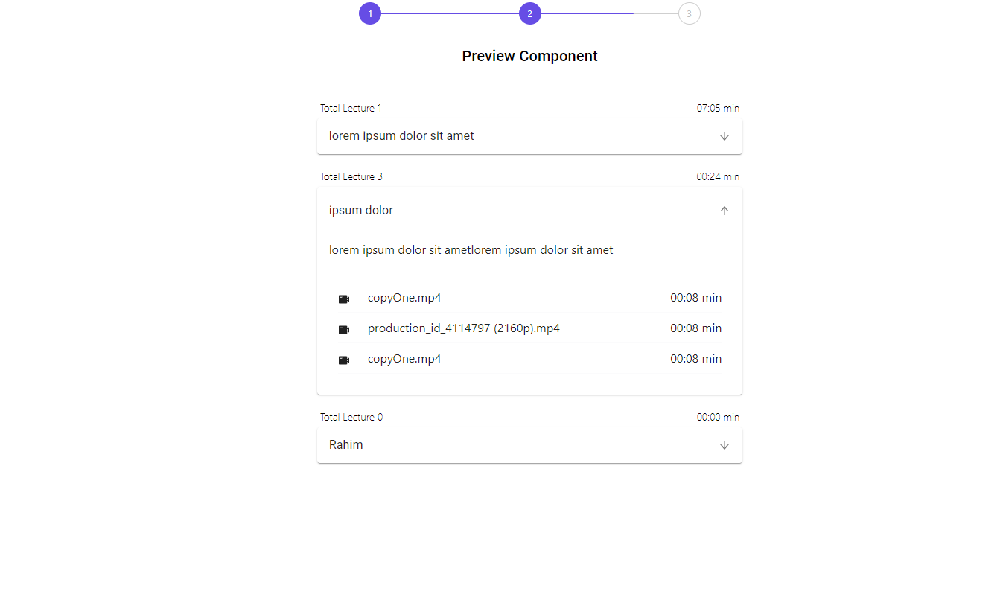
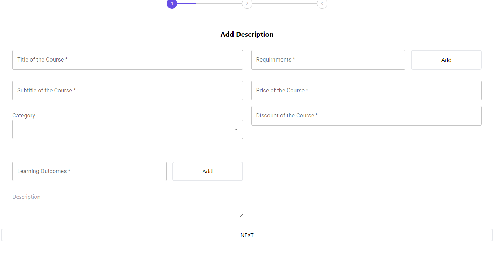
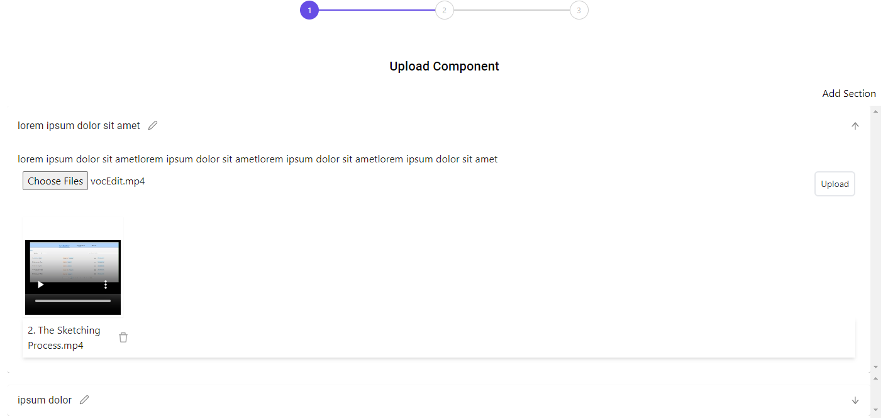

 

<h3 align="center">Learning Management Course Upload MERN</h3>

 

 

## About The Project

## Overview

This Learning Management System (LMS) is a web application built using the MERN stack (MongoDB, Express.js, React, and Node.js). It allows users to create, upload, and preview courses with detailed descriptions and content. Designed to facilitate online learning and course management, this platform provides a robust solution for educational institutions, training organizations, and individual educators.

## Features

- **Course Creation**: Easily create and manage courses with comprehensive descriptions and multimedia content.
- **Content Upload**: Upload various types of course materials, including documents, videos, and images.
- **Content Preview**: Preview course content directly within the application to ensure everything is displayed as intended.
- **User Management**: Supports user roles and permissions for instructors, students, and administrators.
- **Responsive Design**: Optimized for both desktop and mobile devices to ensure a seamless learning experience.

## Technologies

- **Frontend**: React.js – A dynamic and responsive user interface built with React.
- **Backend**: Node.js and Express.js – Server-side logic and RESTful API integration.
- **Database**: MongoDB – NoSQL database for storing course and user data.
- **Authentication**: Implemented user authentication and authorization to secure access and data.

## Installation

To get started with this LMS, follow these steps:

1. **Clone the repository:**
2. **npm i:**
1. **npm run dev**

   
   

